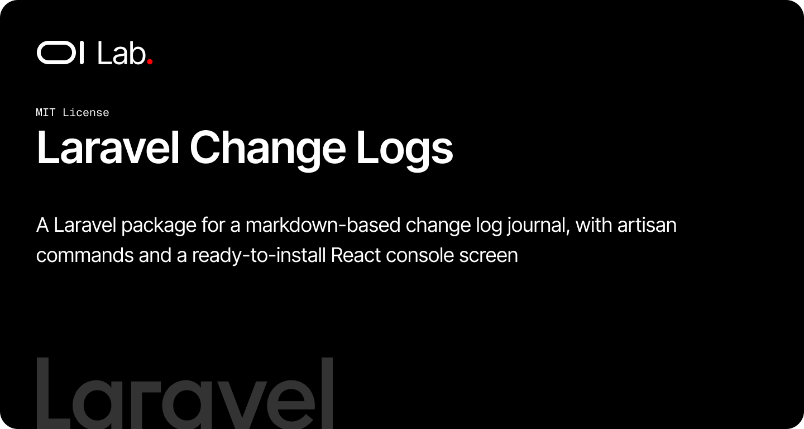

# OI Laravel Changelogs

[](https://packagist.org/packages/oi-lab/oi-laravel-changelogs)
[](https://packagist.org/packages/oi-lab/oi-laravel-changelogs)
[](https://github.com/oi-lab/oi-laravel-changelogs/actions)
[](LICENSE)

The journal of what was fixed and what was improved in your application, kept
as markdown in the repository and read on a screen inside the application. One
file per entry, written in the same pull request as the work it describes,
reviewed with it and deployed with it — no table, no migration, and nothing
that has to be regenerated by hand. The package brings the reader, two artisan
commands to write and to police the entries, and a set of Inertia/React stubs
you install into your own application and then own outright.

## Features

- **Entries are files.** `resources/markdown/change-logs/2026-09-12-a-slug.md`,
  frontmatter plus prose, diffed and reviewed like everything else.
- **A screen to read them.** List on the left, entry on the right, previous and
  next walking the list; opening an entry is a fetch, so the column keeps its
  scroll and the url still follows.
- **`change-log:make`** opens an entry with the frontmatter filled in — HEAD
  included, because the hash exists in the terminal and not in your head.
- **`change-log:check`** holds every entry to the format and prints the tag
  vocabulary in use, so it belongs in your test suite.
- **Typed all the way out.** `spatie/laravel-data` objects on the wire, so
  `oi-laravel-ts` can generate the TypeScript interfaces.
- **Server- or client-side markdown.** Laravel converts it with
  `league/commonmark`, or the browser does with `react-markdown` — one config
  key, and the installer publishes only the renderer you chose.
- **Neutral stubs.** Plain Shadcn UI components — badge, button, item, empty,
  skeleton — with no design system of ours in them.
- **Nothing to regenerate.** The repository fingerprints the directory: a file
  added is a file shown.

## How It Works

The package never writes an entry at runtime and has no endpoint that could.
Reading is three objects deep:

| Object | What it is |
| --- | --- |
| `ChangeLogRepository` | parses the directory, caches the parse under a fingerprint of it, and answers the list, one entry, and the two either side of it |
| `ChangeLogEntry` | one parsed file: slug, title, date, type, tags, commits, the opening paragraph, the body |
| `ChangeLogMarkdown` | the CommonMark converter, kept as a singleton because it is expensive to build and holds nothing |

Two shapes leave the server rather than one. `ChangeLogRowData` is what the
list column draws — frontmatter and the opening paragraph — and there may be a
hundred of them on a page. `ChangeLogEntryData` is the entry being read, with
its content in whichever form the configured engine asked for. Sending the
second shape for every row would put the whole journal on the wire to draw a
column 24rem wide.

The screen is one page behind two routes. `change-logs.show` answers json to a
fetch and the whole page to an Inertia visit or a cold browser, so the pane the
reader swaps and the page a pasted link opens can never drift apart.

## Requirements

- PHP 8.2+
- Laravel 11, 12, or 13
- `spatie/laravel-data` ^4.23, `league/commonmark` ^2.0, `symfony/yaml`
- `inertiajs/inertia-laravel` ^1.0|^2.0 and a React front end, to use the
  published screen

## Installation

```bash
composer require oi-lab/oi-laravel-changelogs
```

Then run the installer, which asks who may read the journal, where the markdown
should be converted, and writes the screen into your application:

```bash
php artisan change-log:install
```

It publishes the config, creates the change log directory with one example
entry, installs the React files, and offers to add the Shadcn UI components the
screen draws with. Everything it writes is yours afterwards — the package
renders nothing itself.

```bash
npm run build
```

Visit `/change-logs`.

### Publish only the configuration

```bash
php artisan vendor:publish --tag=oi-laravel-changelogs-config
```

## Configuration

```php
// config/oi-laravel-changelogs.php

'changelog_path' => 'resources/markdown/change-logs',

// Where the installer writes the React files. The pages path also decides the
// Inertia component the controller renders: "resources/js/pages/console/change-logs"
// is rendered as "console/change-logs/index", so moving the screen into your
// console space is a one-line change and no code edit.
'components_path' => 'resources/js/components/change-logs',
'pages_path' => 'resources/js/pages/change-logs',

'route' => [
    'enabled' => env('OI_CHANGELOGS_ROUTES', true),
    'prefix' => 'change-logs',
    'name' => 'change-logs.',
    'middleware' => ['web'],
],

'rendering' => [
    'markdown_engine' => 'server', // or 'client'
    'ssr' => false,
    'typeset' => false,
],

'entries' => [
    'locale' => null,                                // null = the app's locale
    'summary_words' => ['min' => 30, 'max' => 75],
    'max_tags' => 5,
],

'per_page' => 20,

'cache' => ['store' => null, 'ttl' => 3600],
```

Set `route.enabled` to `false` to keep the reader and declare your own routes
against `ChangeLogController` — inside an authenticated console group, for
instance.

## Usage

### Write an entry

The commit has to exist before the entry can name it, so: commit the fix, then
open the entry.

```bash
php artisan change-log:make "The dashboard came back blank" \
    --type=fix \
    --tag=console --tag=teams
```

With no `--commit`, it fills in HEAD — the commit you just made. The file lands
at `resources/markdown/change-logs/2026-09-12-the-dashboard-came-back-blank.md`
with its frontmatter written and two placeholders where the prose goes:

```markdown
---
title: The dashboard came back blank
date: 2026-09-12
type: fix
tags:
    - console
    - teams
commits:
    - 9a9ab33
---

One paragraph of 30 to 75 words: what the person in front of the screen saw,
then why it happened. It is the summary the list column shows, taken from the
body so there is nowhere for a second copy to drift.

## Changes

- What was changed, one bullet per change, in the past tense.
- End with the tests added, when there are any.
```

An entry is a **subject**, not a commit: three commits fixing one thing are one
entry with three hashes in its `commits:`.

### Check the format

```bash
php artisan change-log:check
```

It names everything wrong with every file — a date the file name disagrees
with, a tag that is not lowercase, an opening paragraph outside the word
bounds, a `TODO` left in the text — and ends by printing the tags in use with
how many entries each one holds, which is how you spot two spellings of one
subject.

The screen skips a malformed file rather than throwing on it, so put the
checker in your test suite and a file that would silently vanish fails the
build instead:

```php
it('keeps every change log entry well formed', function () {
    $this->withoutMockingConsoleOutput();

    expect($this->artisan('change-log:check'))->toBe(0);
});
```

### Read the journal somewhere else

```php
use OiLab\OiLaravelChangelogs\Services\ChangeLogRepository;

public function __construct(private readonly ChangeLogRepository $changeLogs) {}

$latest = $this->changeLogs->all()->take(3);          // Collection<ChangeLogEntry>
$page = $this->changeLogs->paginate(20, 1, $url);     // of ChangeLogRowData
$entry = $this->changeLogs->find('2026-09-12-a-slug');
$detail = $this->changeLogs->detail($entry);          // ChangeLogEntryData
['previous' => $previous, 'next' => $next] = $this->changeLogs->adjacent($entry->slug);
```

## The Published Screen

The installer writes, and you own:

```
resources/js/components/change-logs/
├── types.ts                        # ChangeLogRow, ChangeLogEntry, ChangeLogAnswer
├── change-log-row.tsx              # one row of the list
├── change-log-detail.tsx           # the entry, and the two buttons that walk the list
├── change-log-pagination.tsx       # previous / next / counter
├── change-log-html-content.tsx     # rendering.markdown_engine = "server"
└── change-log-markdown-content.tsx # rendering.markdown_engine = "client"
resources/js/lib/change-log-typography.ts
resources/js/lib/change-log-date.ts
resources/js/layouts/change-logs-layout.tsx
resources/js/pages/change-logs/index.tsx
```

Only the renderer you chose is installed, and the import of the other one is
taken out of `change-log-detail.tsx` — an unused import of `react-markdown` is
a dependency you would have to install to build.

The layout is the neutral one, and the page names it at the bottom:

```tsx
ChangeLogsIndex.layout = (page: ReactNode) => (
    <ChangeLogsLayout>{page}</ChangeLogsLayout>
);
```

Point it at your application's own layout, keeping the two constraints the
neutral one carries: cap the wrapper at `h-svh` and let `min-h-0` through. An
application shell is usually `min-h-svh`, a floor — and a pane asked to scroll
inside a floor never does.

## TypeScript Interfaces

The two Data classes are what `oi-laravel-ts` generates from, so the published
`types.ts` can be replaced by your generated interfaces:

```bash
php artisan oi:gen-ts
```

## AI Assistant Skills

The package ships a skill teaching an AI assistant when an entry is owed, how
one entry covers one subject, and the format the checker enforces. Install it
into the host application:

```bash
php artisan oi:skills oilab-laravel-changelogs --project
```

It is the skill to activate right after committing a fix — before the task is
considered done.

## Testing

```bash
composer test
```

## Contributing

Contributions are welcome! Please feel free to submit a Pull Request.

When contributing:
1. Write tests for new features
2. Ensure all tests pass: `vendor/bin/pest`
3. Follow existing code style
4. Update documentation as needed

## License

The MIT License (MIT). Please see the [License File](LICENSE) for more information.

## Credits

**[Olivier Lacombe](https://www.olacombe.com)** - Creator and maintainer

Olivier is a Product & Technology Director based in Montpellier, France, with
over 20 years of experience innovating in UX/UI and emerging technologies. He
specializes in guiding enterprises toward cutting-edge digital solutions,
combining user-centered design with continuous optimization and artificial
intelligence integration.

**Projects & Resources:**
- [OI Dev Docs](https://dev.olacombe.com) - Documentation for all Open Source OI Lab packages
- [OnAI](https://onai.olacombe.com) - Training courses and masterclasses on generative AI for businesses
- [Promptr](https://promptr.olacombe.com) - Prompt engineering Management Platform

## Support

For support, please open an issue on the [GitHub repository](https://github.com/oi-lab/oi-laravel-changelogs/issues).
